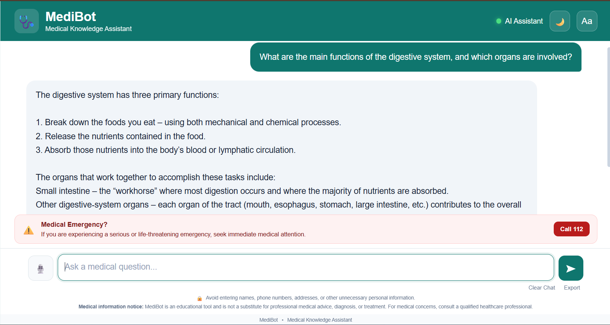

# MediBot - Medical Knowledge Assistant

MediBot is an AI-powered medical knowledge assistant that answers
medical questions using information from a medical knowledge base.

## Frontend Screenshot



## Technologies Used

- Python
- Flask
- HTML
- CSS
- JavaScript
- LangChain
- Groq
- Pinecone
- HuggingFace Embeddings

## Features

- Medical question answering
- Retrieval from medical documents
- AI-generated responses
- Simple and user-friendly interface
- Medical emergency warning

## Backend

The main backend is implemented using Flask in `app.py`.

## How to Run Locally

1. Install the required packages:

```bash
pip install -r requirements.txt